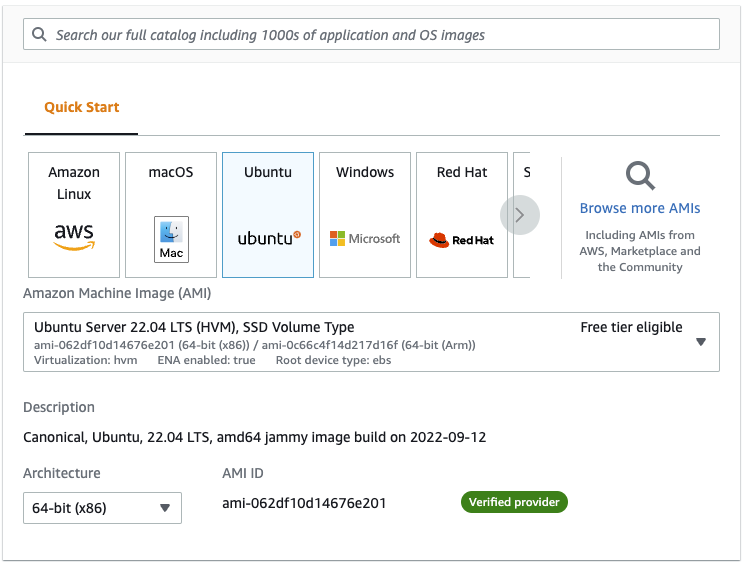
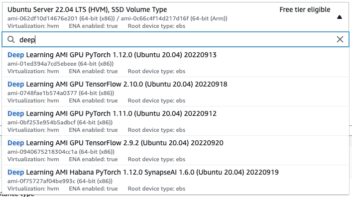
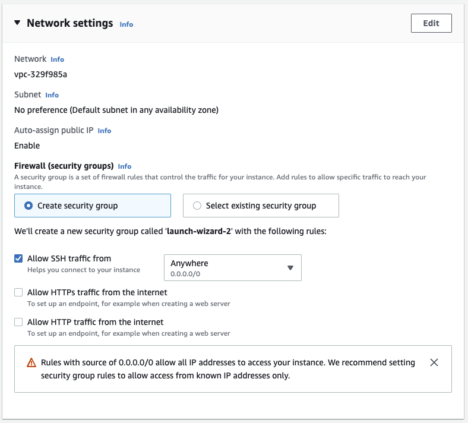
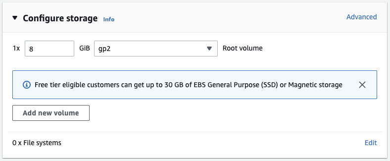
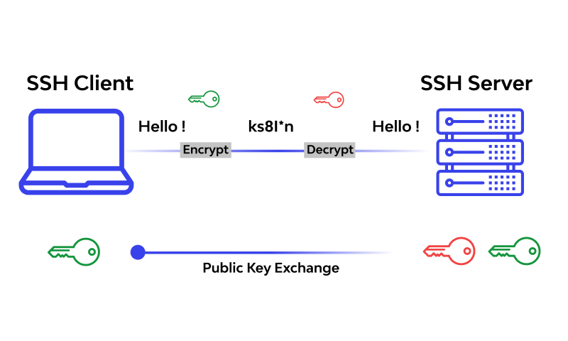
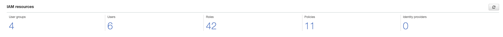
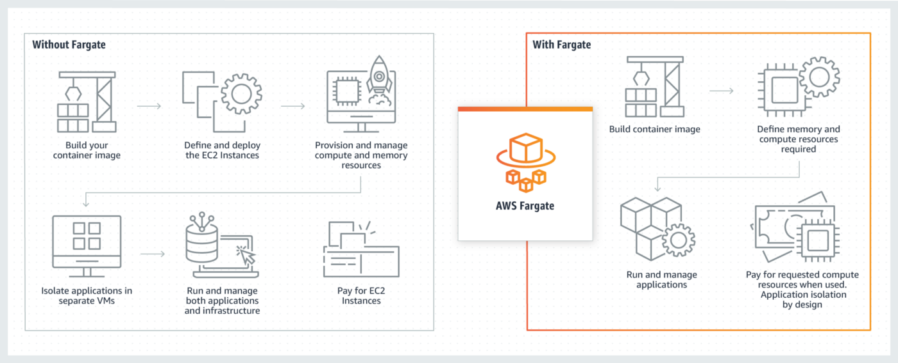
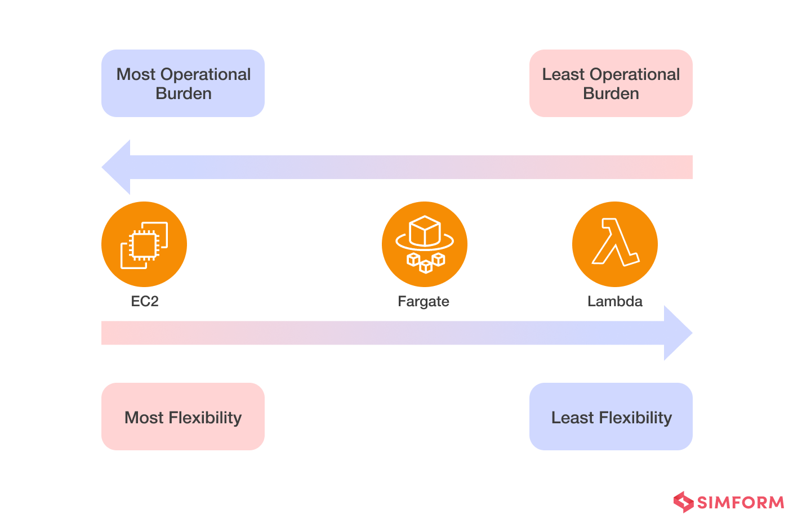

# TOC

- [TOC](#toc)
- [Assignment](#assignment)
- [Bonus Assignment (500 Points)](#bonus-assignment-500-points)
- [Solution](#solution)
- [Bonus Solutions](#bonus-solutions)
  - [Deployment on AWS Fargate](#deployment-on-aws-fargate)
  - [Running Tests](#running-tests)
- [AWS](#aws)
- [EC2 Pricing](#ec2-pricing)
- [Launching an EC2 instance](#launching-an-ec2-instance)
- [Instance Type](#instance-type)
- [Key Pair](#key-pair)
- [Network Settings](#network-settings)
- [Storage](#storage)
- [SSH](#ssh)
- [AWS S3](#aws-s3)
- [AWS CLI](#aws-cli)
- [AWS IAM](#aws-iam)
- [ECS](#ecs)
- [AWS Fargate](#aws-fargate)

# Assignment

1. Take the TRAINED MODEL deployment from previous assignment
- CIFAR10 trained RESNET18 model
- you have to use scripted model
2. Push the Model to S3
3. Modify your deploy script to download model from S3
- you can use boto3 to download from S3 and load the model once
- or you can use a bash script to download using aws cli
- HINT: using S3 on Fargate will require a role to access S3 in Task Definition (Task role)
4. The Demo Web UI must run on port 80 and be publicly accessible
5. Push the Docker Image to ECR
6. Create a Fargate Spot Deployment on ECS
7. Share the link of the github repository that has the Dockerfile for above, and also your inference code
- It should have instructions on how to run the Container ! 
- NOTE: DO NOT EVER PUSH ANY OF YOUR AWS SECRETS TO GITHUB !
8. Share the image and tagname of the repo you pushed to AWS ECR
9. Submit your deployment ip address in Github Classroom which will test your deployment
- try to keep your commits as less as possible <5 commits
- before pushing test it

# Bonus Assignment (500 Points)
1. Save every inference input and output to S3, along with date and time of inference
- You can use Gradio Flagging
- https://gradio.app/using_flagging/Links to an external site.
- https://github.com/gradio-app/gradio/blob/master/gradio/flagging.pyLinks to an external site.
2. The Model S3 URI and the Inference input and output S3 URI must be changeable
- When doing docker run these environment variables will be specified
``` 
Example: docker run -it your_image:latest -e "model=s3://my-bucket/models/resnet18.pth" -e "flagged_dir=s3://my-bucket/outputs/resnet18"
```

3. Bonus assignment must be a different docker image and tag, that is pushed to ECR
4. Share link to the image name and tag and USAGE instructions (should be included in your Github Repo)

# Solution 
 
ECR URI:- `public.ecr.aws/l7c3w2k7/cifar-jit-test:latest`

[python code](./vision.py)

Dockerfile
<details>
<summary><b> Dockerfile</b></summary>

```dockerfile
# Stage 1: Builder/Compiler
FROM python:3.7-slim-buster AS build

COPY requirements.txt .

# Create the virtual environment.
RUN python3 -m venv /venv
ENV PATH=/venv/bin:$PATH

RUN pip3 install --no-cache-dir -U pip && \
    pip3 install --no-cache-dir -r requirements.txt

# Stage 2: Runtime
FROM python:3.7-slim-buster 

COPY --from=build /venv /venv
ENV PATH=/venv/bin:$PATH
ENV GRADIO_SERVER_PORT 80

WORKDIR /code

COPY vision.py .

EXPOSE 80
ENTRYPOINT ["python3", "vision.py"]
```

</details>

# Bonus Solutions


```bash
docker run -p <port>:<port> -e "model=s3://<bucket_name>/<model_path>" -e "flagged_dir=s3://<bucket_name>/<upload_path>" <image_name>:<tag>
```

ECR URI:- public.ecr.aws/l7c3w2k7/cifar-jit-test:bonus

```bash
docker run -p 80:80 -e "model=s3://cifar10-emlov2/models/model.traced.pt" -e "flagged_dir=s3://cifar10-emlov2/outputs/resnet_18_traced" s5:bonus
```

[python code for bonus](./vision_bonus.py)

<details>
<summary><b>Dockerfile for bonus Assignment:</b></summary>

```dockerfile
# Stage 1: Builder/Compiler
FROM python:3.7-slim-buster AS build

COPY requirements.txt .

# Create the virtual environment.
RUN python3 -m venv /venv
ENV PATH=/venv/bin:$PATH

RUN pip3 install --no-cache-dir -U pip && \
    pip3 install --no-cache-dir -r requirements.txt

# Stage 2: Runtime
FROM python:3.7-slim-buster 

COPY --from=build /venv /venv
ENV PATH=/venv/bin:$PATH
ENV GRADIO_SERVER_PORT 80

RUN apt-get update && apt-get install ffmpeg libsm6 libxext6  -y
WORKDIR /code

COPY utils.py .
COPY vision_bonus.py .

EXPOSE 80
ENTRYPOINT ["python3", "vision_bonus.py"]
```
</details>

## Deployment on AWS Fargate

Modify `deployment.json` and modify the ip address to point to your fargate deployment public ip

so if your public ip is `65.2.48.23`

then your deployment.json will be

```json
{
	"base_url": "http://65.2.48.23/api/predict"
}
```

NOTE: DO NOT MODIFY ANY FILE OTHER THAN `deployment.json`

## Running Tests

```bash
python test_deploy.py
```

If your tests pass you will get output like

```text
using base_url=http://65.2.48.23/api/predict


testing: cat.png
response: {"data":[{"label":"cat","confidences":[{"label":"cat","confidence":0.999994158744812},{"label":"dog","confidence":5.6652002058399376e-6},{"label":"frog","confidence":3.1249111742681634e-8},{"label":"deer","confidence":2.6211500525619158e-8},{"label":"horse","confidence":2.0557010316224478e-8},{"label":"bird","confidence":6.691818654758208e-9},{"label":"airplane","confidence":2.7561453119773205e-9},{"label":"truck","confidence":2.4540329768285574e-9},{"label":"ship","confidence":9.43536915265497e-10},{"label":"automobile","confidence":6.190959966900778e-10}]}],"is_generating":false,"duration":0.013329029083251953,"average_duration":0.014286404564267113}
predicted label: cat
done testing: cat.png

testing: ship.png
response: {"data":[{"label":"ship","confidences":[{"label":"ship","confidence":1.0},{"label":"automobile","confidence":9.336627471157044e-9},{"label":"airplane","confidence":7.57514850846519e-9},{"label":"truck","confidence":1.1073797434590915e-9},{"label":"frog","confidence":1.0472808176231752e-9},{"label":"horse","confidence":6.553890763427717e-10},{"label":"bird","confidence":5.482366227660407e-10},{"label":"deer","confidence":3.4371433477176083e-10},{"label":"cat","confidence":2.926026088090339e-10},{"label":"dog","confidence":2.4079613303307212e-11}]}],"is_generating":false,"duration":0.013693809509277344,"average_duration":0.014259468425403942}
predicted label: ship
done testing: ship.png

testing: automobile.png
response: {"data":[{"label":"automobile","confidences":[{"label":"automobile","confidence":0.999056875705719},{"label":"cat","confidence":0.0005809720605611801},{"label":"dog","confidence":0.00027817129739560187},{"label":"ship","confidence":0.00002417233190499246},{"label":"airplane","confidence":0.00002368592868151609},{"label":"truck","confidence":0.00002277449493703898},{"label":"horse","confidence":6.169487733131973e-6},{"label":"frog","confidence":3.0082594548730412e-6},{"label":"deer","confidence":2.7477401545183966e-6},{"label":"bird","confidence":1.3877607898393762e-6}]}],"is_generating":false,"duration":0.014853715896606445,"average_duration":0.014285305271977964}
predicted label: automobile
done testing: automobile.png

testing: dog.png
response: {"data":[{"label":"dog","confidences":[{"label":"dog","confidence":1.0},{"label":"cat","confidence":9.848699633607794e-9},{"label":"ship","confidence":3.5788474406217574e-9},{"label":"automobile","confidence":7.653569444876496e-10},{"label":"horse","confidence":6.926725859557337e-10},{"label":"frog","confidence":6.077449654640077e-10},{"label":"deer","confidence":4.206467674183756e-10},{"label":"bird","confidence":3.910529955408748e-10},{"label":"airplane","confidence":2.5110252765969676e-10},{"label":"truck","confidence":1.7144097252952406e-10}]}],"is_generating":false,"duration":0.013829946517944336,"average_duration":0.014266331990559896}
predicted label: dog
done testing: dog.png

.
----------------------------------------------------------------------
Ran 1 test in 0.081s

OK
```


# AWS

Amazon web service is an online platform that provides scalable and cost-effective cloud computing solutions. AWS is a broadly adopted cloud platform that offers several on-demand operations like compute power, database storage, content delivery, etc., to help corporates scale and grow.


The Amazon Web Services (AWS) platform provides more than 200 fully featured services from data centers located all over the world, and is the world's most comprehensive cloud platform.

Amazon web service is an online platform that provides scalable and cost-effective cloud computing solutions.

AWS is a broadly adopted cloud platform that offers several on-demand operations like compute power, database storage, content delivery, etc., to help corporates scale and grow.

https://aws.amazon.com/ec2/instance-types/


# EC2 Pricing

https://aws.amazon.com/ec2/pricing/

On Demand: https://aws.amazon.com/ec2/pricing/on-demand/

Spot:https: //aws.amazon.com/ec2/spot/pricing/

Pricing Calculator: https://calculator.aws/

# Launching an EC2 instance

1. Go to EC2 Dashboard
2. Click on “Launch Instances”
3. Make sure to use the new launch instance ui.
   
AMIs are like your OS Image, they contain the entire OS and this will be on the disk attached to your EC2.



Here you can choose the OS type and also the architecture, since there are ec2 instances which are specifically arm based (aws gravitron instances) and if you choose the wrong architecture type then you’ll not be able to use that instance.

Deeplearning has it’s own special images !



# Instance Type

This is the most important part of the EC2 launching process, here you select the type of instance and you select the instance which meets your criteria and has the best price to performance ratio.

Note the “Free tier eligible” instance because these are free for your new AWS account for a year.


# Key Pair

A Key-Pair is a Public-Private key pair, in which the public key is stored in the instance, and the private key is given to you to download, which we will use to connect to the instance. In case you ever lose your key, you wont be able to login to the instance directly.


# Network Settings

This is another important part of the setup, It allows you to specify which ports of the instance will be accessible over the internet and which will not.


# Storage

This will be the root volume of your system, and the storage is called “EBS” (Elastic Block Storage)

The types of volumes are here: https://aws.amazon.com/ebs/volume-types/


# SSH

Secure Shell, Its most notable applications are remote login and command-line execution



Before we can use our private key to login to the instance we need to change its permissions slightly. (If you are on windows, i highly recommend you to use WSL)
```
chmod 600 key_pair.pem
```
If you wan to know how the magic 600 came from:https://chmod-calculator.com/
```
ssh -i -vvv key_pair.pem ubuntu@<ip_address>
```
Lets say we don't want to use the pem file, because its a hassle to type so much 

```
cat ~/.ssh/id_rsa.pub
```
 

Here you can see all public keys

Add a New line and paste your public key you copied. Save and Exit.

 

Now you can SSH into your server with

```
ssh ubuntu@<ip_address>
```


# AWS S3

S3 Storage Tiers


To change the Storage Tier of an Object

Select Object(s) → Actions → Edit Storage Class

S3 Pricing

https://aws.amazon.com/s3/pricing/Links

S3 Free Tier

“new AWS customers receive 5GB of Amazon S3 storage in the S3 Standard storage class; 20,000 GET Requests; 2,000 PUT, COPY, POST, or LIST Requests; and 100 GB of Data Transfer Out each month.”

Before we can use S3 we need to setup AWS CLI

# AWS CLI

Everything that you can do using UI you can do using CLI

AWS CLI Installation

https://docs.aws.amazon.com/cli/latest/userguide/getting-started-install.html

```
curl "<https://awscli.amazonaws.com/awscli-exe-linux-x86_64.zip>" -o "awscliv2.zip"
unzip awscliv2.zip
sudo ./aws/install
```
Before we can use AWS CLI we need to setup AWS IAM

# AWS IAM



Create a New Role with S3 Access to our Bucket

 

IAM → Roles → Create Role

```
{
    "Version": "2012-10-17",
    "Statement": [
        {
            "Effect": "Allow",
            "Action": [
              "s3:PutObject",
              "s3:GetObject",
              "s3:GetObjectVersion",
              "s3:DeleteObject",
              "s3:DeleteObjectVersion"
            ],
            "Resource": "arn:aws:s3:::<bucket>/*"
        },
		]
}
```
Here we are saying that this role can upload, download and delete any object in bucket

Attaching IAM to EC2

Actions → Security → Modify IAM Role

Select the IAM Role and Update IAM role

Now we can go ahead and use the S3 cli

# ECS

Amazon Elastic Container Service is Amazon’s own container orchestration platform. The idea is very similar to Kubernetes.

Irrespective of whichever container orchestration service you are using (ECS or EKS), there are two ways you can implement the underlying infrastructure:

Manually manage the cluster and underlying infrastructure such as Virtual Machines / Servers / (also known as EC2 instances).
Serverless — Absolutely no need to manage anything. Just upload the container and that’s it. ← This is AWS Fargate.

# AWS Fargate

AWS Fargate is a serverless compute engine for containers that works with both Amazon Elastic Container Service (ECS) and Amazon Elastic Kubernetes Service (EKS). Fargate makes it easy for you to focus on building your applications. Fargate removes the need to provision and manage servers, lets you specify and pay for resources per application, and improves security through application isolation by design.

https://aws.amazon.com/fargate/pricing/

With AWS Fargate, you pay for the amount of vCPU and memory resources that your containerized application requests. vCPU and memory resources are calculated from the time your container images are pulled until the Amazon ECS Task terminates, rounded up to the nearest second. A minimum charge of one minute applies.

 
 


 It is important to notice that with Lambda you don't need to build, secure, or maintain a container. You just worry about the code. Now as mentioned already, Lambda has a max run time limit and 3GB memory limit (CPU increases proportionally). Also if it is used sporadically it may need to be pre-warmed (called on a schedule) for extra performance.

Fargate manages docker containers, which you need to define, maintain and secure. If you need more control of what is available in the environment where your code runs, you could potentially use a container (or a server), but that again comes with the management. You also have more options on Memory/CPU size and length of time your run can take to run.

Even for an API server as you mentioned you could put API gateway in front and call Lambda.


