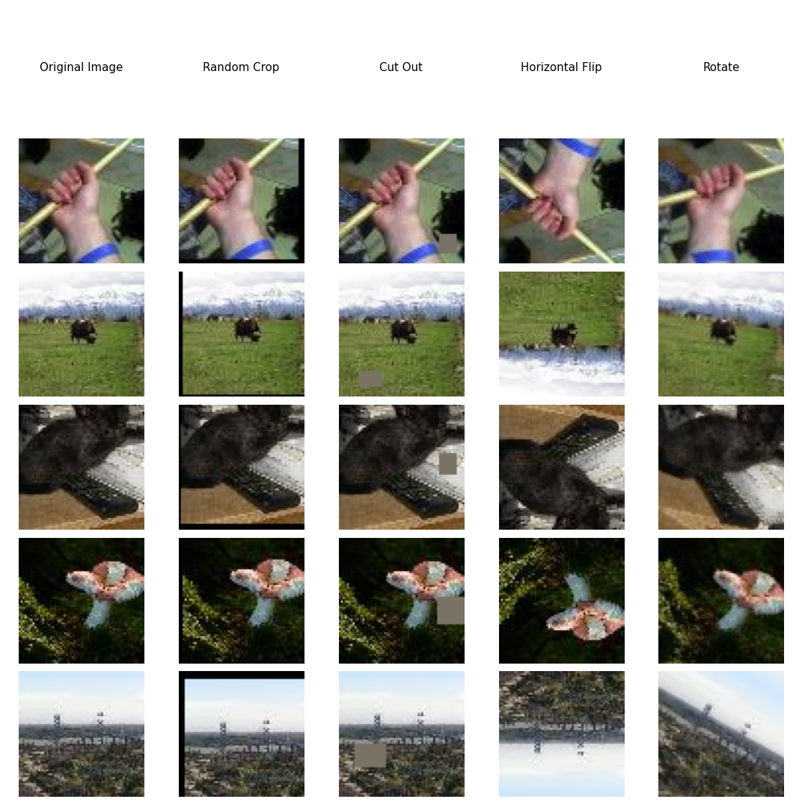

# Submission for Week 10

- [Problem Statement](#problem-statement)
- [Results & Analysis](#results-analysis)
- [CIFAR-10 Augmentation Vizulation](#cifar-10-augmentation-vizualization)
- [Model Evaluation](#model-evaluation)
  * [Custom-resnet Learning Curve](#Custom-resnet-learning-curve)
  * [Custom-resnet Misclassified Images](#Custom-resnet-misclassified-images)
- [Team Members](#team-members)


# Problem Statement
1. Assignment A:
   1. Download this [TINY IMAGENET ](http://cs231n.stanford.edu/tiny-imagenet-200.zip)dataset. 
   2. Train ResNet18 on this dataset (70/30 split) for 50 Epochs. Target 50%+ Validation Accuracy. 
   3. Submit Results. Of course, you are using your own package for everything. You can look at [this ](https://github.com/sonugiri1043/Train_ResNet_On_Tiny_ImageNet/blob/master/Train_ResNet_On_Tiny_ImageNet.ipynb) for reference. 
2. Assignment B:
   1.  Learn how COCO object detection dataset's schema is. This file has the same schema. You'll need to discover what those number are. 
   2. Identify these things for this dataset:
      1. readme data for class distribution (along with the class names) along with a graph 
      2. Calculate the Anchor Boxes for k = 3, 4, 5, 6 and draw them.


# Assignment A
Link to [Notebook](https://github.com/vivek-a81/EVA6/blob/main/Session9/Session9.ipynb)

Link to [Main Repo](https://github.com/MittalNeha/vision_pytorch)


- Dataset Used: tiny ImageNet
- Test Accuracy : 88.66%
- Train Accuracy : 94.34%
- LR finder was used to find the best accuracy and used as the lr_max in OneCycleLR
- LR Finder plot
<p float="center">
  
</p>
Augmentation Strategy Used
```
     A.Sequential([
                   A.CropAndPad(px=4, keep_size=False), #padding of 2, keep_size=True by defaulf
                   A.RandomCrop(32,32)
                   ]),
     A.HorizontalFlip(),
     A.CoarseDropout(1, 8, 8, 1, 8, 8,fill_value=0.473363, mask_fill_value=None),
     A.Normalize((0.49139968, 0.48215841, 0.44653091), (0.24703223, 0.24348513, 0.26158784))
```
One Cycle Policy
```
scheduler = torch.optim.lr_scheduler.OneCycleLR(optimizer, 
                                                max_lr=ler_rate/10,
                                                steps_per_epoch=len(train_loader), 
                                                epochs=24,
                                                pct_start=0.2,
                                                div_factor=10,
                                                three_phase=False, 
                                                anneal_strategy='linear'
                                                ) 
```
<p float="center">
  
</p>

# Imagenet Augmentation Vizualization

- **DataSet:** tiny Imagenet has **200 classes** of **64x64** images. Each class has 500 images in the training dataset

<p float="center">
  
</p>


# Model Evaluation

We have plotted
* Custom resnet Learning Curve
* Custom resnet Misclassified Images


Custom resnet Learning Curve
--------------------------

<p float="center">
  
</p>


Custom resnet Misclassified Images
--------------------------

<p float="center">
  
</p>


References
------------------------

* https://github.com/sonugiri1043/Train_ResNet_On_Tiny_ImageNet/blob/master/Train_ResNet_On_Tiny_ImageNet.ipynb


Team Members
------------------------

Neha Mittal, Vivek Chaudhary

