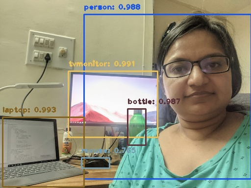
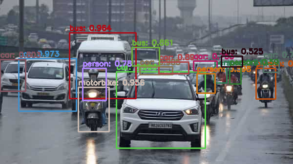

# Submission for Week 11

- [OpenCV Yolo](##opencv-yolo)
- [Results](#results)
- [Training YOLO](#training-yolo)
- [Refrences](#references)
- [Team Members](#team-members)

# OpenCV Yolo

**Problem Statement:**

- OpenCV YoloV3: [SOURCE](https://pysource.com/2019/06/27/yolo-object-detection-using-opencv-with-python/)
     1. Run this above code on your laptop or Colab. 
     2. Take an image of yourself, holding another object which is there in COCO data set (search for COCO classes to learn). 
     3. Run this image through the code above. 
     4. Upload the link to GitHub implementation of this
     5. Upload the annotated image by YOLO. 
 
- Link to [Notebook](https://github.com/vivek-a81/EVA6/blob/main/Session11/S11P1.ipynb)

Results
------------
Given the weights and configuration for yolo, we ran inference using OpenCV function "dnn.blobFromImage". Some of the resulting images are shown below along with the boundbox, identified label and the confidence score.

**Testing On Our Images:**

 

 

**Testing On More Images:**

 
 
 

# Training YOLO
**Problem Statement:**

1. Training Custom Dataset on Colab for YoloV3
     1. Refer to this Colab File:  [LINK](https://colab.research.google.com/drive/1LbKkQf4hbIuiUHunLlvY-cc0d_sNcAgS)
     2. Refer to this GitHub [Repo](https://github.com/theschoolofai/YoloV3)
     3. Download this dataset (Links to an external site.). This was annotated by EVA5 Students. Collect and add 25 images for the following 4 classes into the dataset shared:
           1. class names are in custom.names file. 
           2. you must follow exact rules to make sure that you can train the model. Steps are explained in the README.md file on github repo link above.
           3. Once you add your additional 100 images, train the model         
2. Once done:
      1. [Download](https://www.y2mate.com/en57) a very small (~10-30sec) video from youtube which shows your classes. 
      2. Use [ffmpeg](https://en.wikibooks.org/wiki/FFMPEG_An_Intermediate_Guide/image_sequence) to extract frames from the video. 
      3. Upload on your drive (alternatively you could be doing all of this on your drive to save upload time)
      4. Infer on these images using detect.py file. **Modify** detect.py file if your file names do not match the ones mentioned on GitHub. 
      python detect.py --conf-three 0.3 --output output_folder_name
      5. Use  ffmpeg  to convert the files in your output folder to video
      6. Upload the video to YouTube. 
      7. Also run the model on 16 images that you have collected (4 for each class)

Results
------------
We forked out of the schoolofai github and created out own for ease, [here](https://github.com/MittalNeha/YoloV3)

Custom dataset was downloaded, annotated and uploaded to the YoloV3 repository. This is the [notebook](https://github.com/vivek-a81/EVA6/blob/main/Session11/Training_YOLO.ipynb) used to train this model.

One of the test videos have been uploaded to youtube [link](https://www.youtube.com/watch?v=K5zuxPn4BSo&ab_channel=NehaMittal)

References
------------------------

* https://github.com/theschoolofai/YoloV3
* https://pysource.com/2019/06/27/yolo-object-detection-using-opencv-with-python/
* https://colab.research.google.com/drive/1LbKkQf4hbIuiUHunLlvY-cc0d_sNcAgS

Team Members
------------------------

Neha Mittal, Vivek Chaudhary
