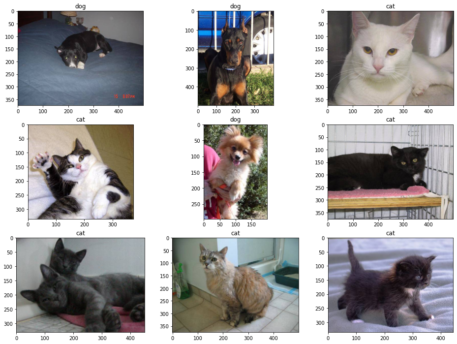
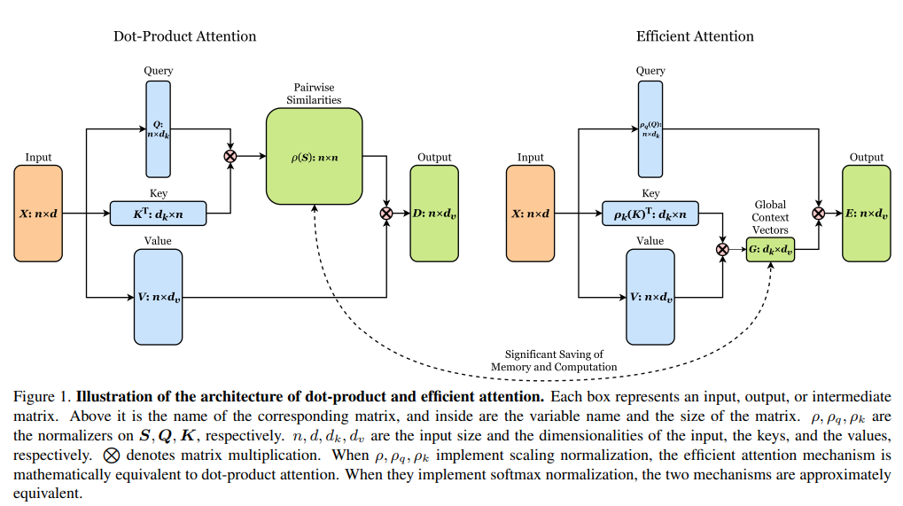
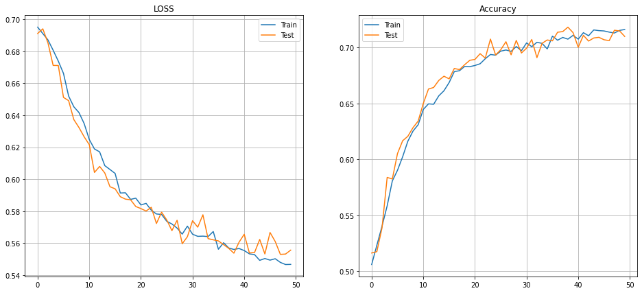

# Submission for Week 13

- [Problem Statement](#problem-statement)
- [Results](#results)
- [Model Evaluation](#model-evaluation)
  * [Training Logs last 5 epoch](#training-logs)
  * [Learning Curve](#learning-curve)
- [Team Members](#team-members)
- [Vision Transformers Implementation](https://github.com/vivek-a81/EVA6/blob/main/Session13/VIT/ReadMe.md)


# Problem Statement


Let's review this [blog](https://analyticsindiamag.com/hands-on-vision-transformers-with-pytorch/) on using ViT for Cats vs Dogs. Your assignment is to implement this blog and train the ViT model for Cats vs Dogs. If you wish you can use transfer learning.
* Share the link to the README that describes your CATS vs DOGS training using VIT. Expecting to see the training logs (at least 1) there.  
* Share the link to the notebook where I can find your Cats vs Dogs Training
* Expecting a Separate or same README to explain your understanding of all the Classes that we covered in the class. 


# Results

- Link to [Notebook](https://github.com/vivek-a81/EVA6/blob/main/Session13/ViT_Cats_n_Dogs.ipynb)
- Link to [VIT understanding](https://github.com/vivek-a81/EVA6/blob/main/Session13/VIT/ReadMe.md)
- Link to [Main Repo](https://github.com/MittalNeha/vision_pytorch)
- Train loss : 0.5467 - Train acc: 0.7163 
- val_loss : 0.5556 - val_acc: 0.7100

# Data Vizulization


<p float="center">
  
</p>


# Model Evaluation

The blogger has used a "Linformer: Self-Attention with Linear Complexity". The network used in this paper uses Efficient Attention, which is a memory efficient form of Self Attention.
<p float="center">
  
</p>

`model = ViT(`  `dim=128,`
  `image_size=224,`
  `patch_size=32,`
  `num_classes=2,`
  `transformer=efficient_transformer,`
  `channels=3,`
`).to(device)`

In this implementation, the patch_size used is 32x32. Since the input image is 224x224, there will be 7x7 patches. Hence, the dimensions of positional embeddings will be (7x7 + 1)x(32x32x3) = 50x3072


Training Logs
--------------------------

* Here are last 5 logs
```
HBox(children=(FloatProgress(value=0.0, max=313.0), HTML(value='')))
Epoch : 45 - loss : 0.5504 - acc: 0.7153 - val_loss : 0.5532 - val_acc: 0.7093

HBox(children=(FloatProgress(value=0.0, max=313.0), HTML(value='')))
Epoch : 46 - loss : 0.5493 - acc: 0.7150 - val_loss : 0.5666 - val_acc: 0.7071

HBox(children=(FloatProgress(value=0.0, max=313.0), HTML(value='')))
Epoch : 47 - loss : 0.5502 - acc: 0.7139 - val_loss : 0.5610 - val_acc: 0.7063

HBox(children=(FloatProgress(value=0.0, max=313.0), HTML(value='')))
Epoch : 48 - loss : 0.5479 - acc: 0.7131 - val_loss : 0.5529 - val_acc: 0.7156

HBox(children=(FloatProgress(value=0.0, max=313.0), HTML(value='')))
Epoch : 49 - loss : 0.5466 - acc: 0.7155 - val_loss : 0.5531 - val_acc: 0.7150

HBox(children=(FloatProgress(value=0.0, max=313.0), HTML(value='')))
Epoch : 50 - loss : 0.5467 - acc: 0.7163 - val_loss : 0.5556 - val_acc: 0.7100
```


Learning Curve
----------------

<p float="center">
  
</p>


Team Members
------------------------

Neha Mittal, Vivek Chaudhary
