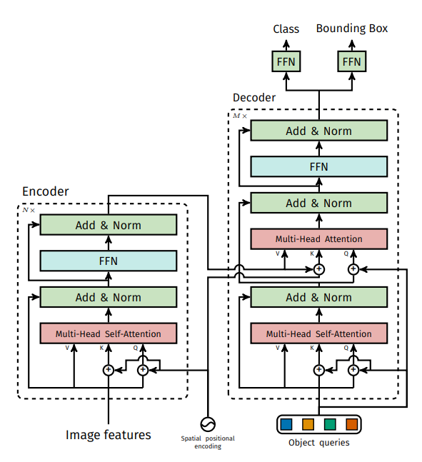
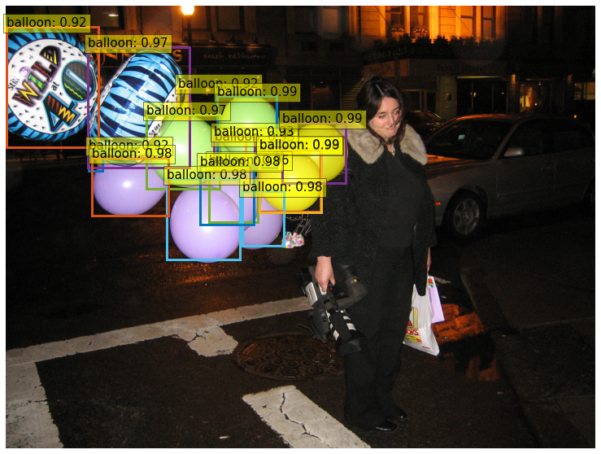
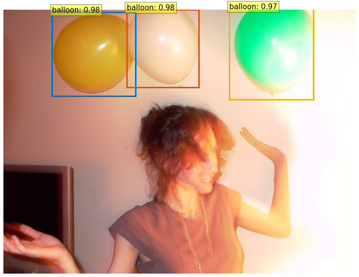

# Submission for Week 14

- [Problem Statement](#problem-statement)
- [DETR](#detr--detection-transform)
- [Encoder Decoder Architecture](#encoder-decoder-architecture)
- [Bipartite Loss](#bipartite-loss)
- [Object Queries](#object-queries)
- [Team Members](#team-members)

# Problem Statement

* Take a look at this [post (Links to an external site.)](https://opensourcelibs.com/lib/finetune-detr), which explains how to fine-tune DETR on a custom dataset. 
* Replicate the process and train the model yourself. [Everything (Links to an external site.)](https://colab.research.google.com/github/woctezuma/finetune-detr/blob/master/finetune_detr.ipynb) is mentioned in the post. The objectives are:
  1. to understand how fine-tuning works
  2. to understand architectural related concepts
  3. be ready to format "your" dataset into something that can be used for custom fine-tuning of DETR. 
  4. Expecting a readme file (along with Colab link in this README file) that:
     1. explains DETR
     2. explains encoder-decoder architecture
     3. explains bipartite loss, and why we need it
     4. explains object queries
     5. shows your results (your model on your dataset)
  5. Expecting a notebook imported from Google Colab

# DETR ( Detection Transform)

The DEtection TRansformer (DETR) is an object detection model, developed by Facebook Research. It utilizes Transformers with a backbone of ResNet50. DETR predicts all all objects at once and is trained end-to-end with a set loss function which performs bipartite matching between predicted and ground-truth objects. Unlike most existing detection methods, DETR doesn't  require any customized layers and can be reproduced easily in any framework that contains standard CNN and transformer classes. 

  

Here is a summary of how DETR works:

1. The image is passed through a backbone network (ResNet50) which gives a set of image features. The pretrained CNN backbone, which produces a set of lower dimensional set of features. These features are then scaled and added to a positional encoding, which is fed into a Transformer consisting of an Encoder and a Decoder.
2. Having width W and height H (In practice, we set C=2048, W=W₀/32 and H=H₀/32).
3. The image features pass through a Transformer which consists of an encoder and a decoder.
4. The output of decoder is 100 values which when passed through a FFN ( Feed Forward Network), give the prediction bbox.
5. While training, the output is passed through a bipartite matching loss function between the predicted bounding boxes and ground-truth boxes. This is because the predictions made are out of order. 

# Encoder-Decoder Architecture

  

The above image shows the detailed blocks in the Transformer layer. There are some interesting things happening here:

1. The output from the encoder is passed to the decoder as key and value but the query comes from the decoder itself. 
2. The input to the decoder is object queries which are trainable parameters. Along with that it also gets the encoder memory, and produces the final set of predicted class labels and bounding boxes through multiple multi self-attention and decoder-encoder attention. 

# Bipartite loss

Bipartite matching is one to one matching. In case of DETR, the output is not ordered, hence one by one matching is needed to find the loss by matching the predicted labels and ground truth labels.

# Object Queries

They are "additional inputs" to the decoder. These are the 100 learned vectors, that finally result in 100 bounding boxes! (DETR can at max detect 100 boxes). These 100 vectors/encodings, are somewhat similar to Anchor Boxes, but unlike them, these are not learning the sizes, but the location of these boxes. The 100 object queries are transformed into an output embedding by the decoder. They are then independently decoded into box coordinates and class labels by a feed forward network. 

  

Here the above picture there are 20 out of 100 object quaires shown, each of the object quary is focsing on a particular location like the first quary is more focused to the bottom left of image and the next quary is looking at the middle part. Since the quaries can communicate with each other due to attention, each of them can focus on a different location and can avoid predicting same bounding boxes. These quaries are independent of the class. Each object query will look for a particular object in the image. The decoder updates these embeddings through multiple self-attention and encoder-decoder attention layers

# Results

After training here are some of the test images from the trained model

  

  

Team Members
------------------------

Neha Mittal, Vivek Chaudhary
