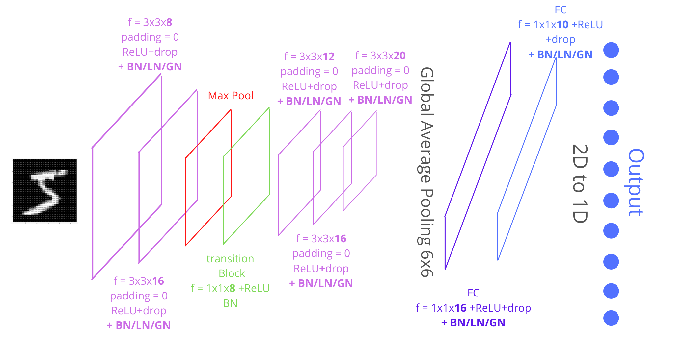
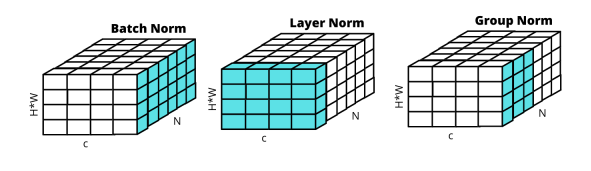

# Submission for Week 6
[TOC]

# Problem Statement

You are making 3 versions of your 5th assignment's best model (or pick one from best assignments):

1. Network with Group Normalization + L1
2. Network with Layer Normalization + L2
3. Network with L1 + L2 + BN

# Our Model

Our Module class Net() takes a parameter for normalization. For example:

`model_gn = model.Net('gn').to(device)`

the values for norm can be:

    'bn': Batch Normalization

    'gn': Group Normalization

    'ln': Layer Normalization


The norm_layer is defined using a function that decides which normalization to use

```
def normalize(x, w, h):
    if norm=='bn':
    	return nn.BatchNorm2d(x)
    elif norm=='ln':
    	return nn.GroupNorm(1,x)
    elif norm=='gn':
    	return nn.GroupNorm(num_groups,x)
    else:
    	return None
```


## Understanding Normalization

Batch Normalization:  

Group Normalization: 

Layer Normalization:



## Findings on Normalization

Amongst the models trained, Layer Norm + L2 gave the best Test accuracy of 99.5%. Based on the logs these observations were made:

- Group Normalization + L1 is not a stable 
- Batch Normalization + L1 + L2 is not a very stable network in terms of consistent test accuracies while training. 

 In order to understand this result, we performed a number of experiments with different combinations of Normalizations. Besides the Accuracy and Loss numbers, we also calculated the **test/validation error rate** for a better intuition. 

On comparing GN, BN, LN Batch Norm gave the better numbers

|      | Test Accuracy | Test loss | Error Rate |
| ---- | :-----------: | :-------: | :--------: |
| BN   |   *99.31%*    | *0.0215*  |   *0.69*   |
| LN   |    99.23%     |  0.0278   |    0.77    |
| GN   |    99.20%     |  0.0287   |   1.09 ?   |

Further to see the effect of L1 and L2 Norm, all the combinations were tried, below are the results

|                   | Test Accuracy | Test Loss | Error Rate |
| ----------------- | :-----------: | :-------: | :--------: |
| GN                |    99.27%     |  0.0261   |    0.73    |
| GN + L1           |               |           | 0.75/0.69  |
| GN + L2           |               |           |            |
| GN + L1 + L2      |    99.15%     |  0.0306   |    0.85    |
| LN                |               |           |    0.77    |
| LN + L1           |               |           |    0.66    |
| LN + L2           |               |           | 0.62/0.71  |
| LN + L1 + L2      |               |           |    0.84    |
| BN ( 128)         |               |           |    0.69    |
| BN + L1           |               |           |            |
| BN + L2           |               |           |            |
| BN(128) + L1 + L2 |               |           |    0.68    |
|                   |               |           |            |
|                   |               |           |            |

Error rate

## Sample Calculations

Below is the snapshot of the calculations performed on sample image inputs
[Link to Excel](https://github.com/vivek-a81/EVA6/blob/main/Session6/Normalization%20Calculations.xlsx)


## Train and Test Graphs

<image>


## Misclassified Images


## 


## Team Members

Neha Mittal, Vivek Chaudhary
