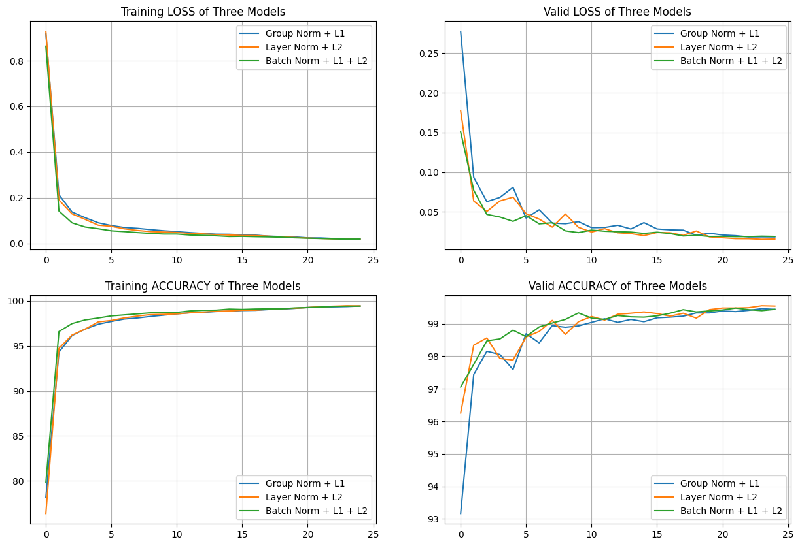
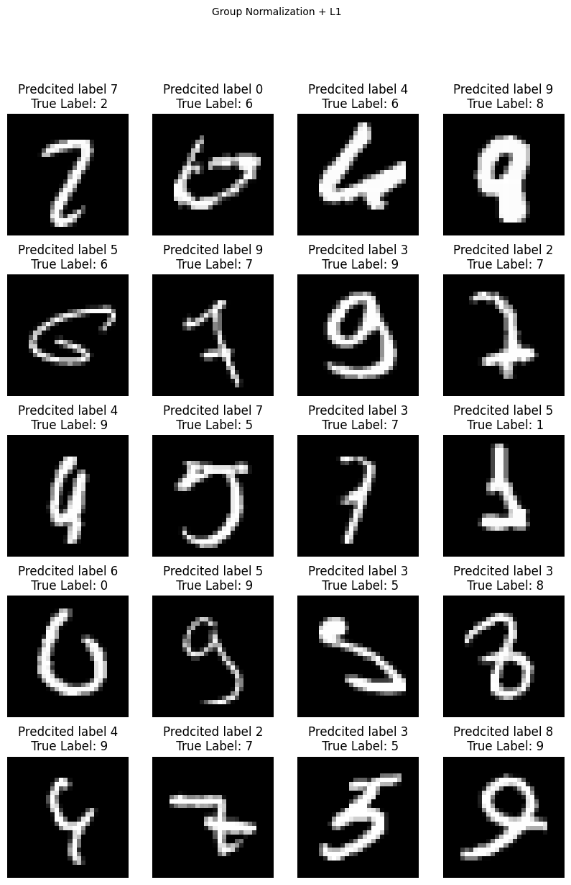
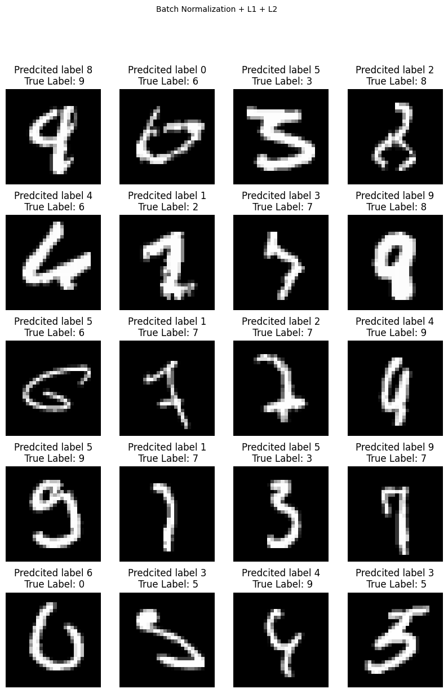

# Submission for Week 6
- [Problem Statement](#problem-statement)
- [Our Model](#our-model)
    + [Results](#results)
  * [Understanding Normalization](#understanding-normalization)
  * [Findings on Normalization For Normalization ](#findings-on-normalization-for-normalization )
  * [Sample Calculations](#sample-calculations)
  * [Train and Test Graphs](#train-and-test-graphs)
  * [Misclassified Images](#misclassified-images)
 - [Team Members](#team-members)


# Problem Statement

You are making 3 versions of your 5th assignment's best model (or pick one from best assignments):

1. Network with Group Normalization + L1
2. Network with Layer Normalization + L2
3. Network with L1 + L2 + BN


# Our Model

### Results

| Model | Training Acc | Train Loss | Testing Acc | Testing Loss | Error Rate |
| :----: | :----: | :----: | :----: | :----: | :----: |
| **GN + L1** | 99.44 | 0.01879 | 99.46 | 0.0185 | 0.54% |
| **LN + L2** | 99.46 | 0.018 | **99.55** | **0.0154** | **0.45%**|
| **BN + L1 + L2** | 99.43 | 0.0189 | 99.48 | 0.0187 | 0.62% |

The link to the notebook (with the results) is [here](https://github.com/vivek-a81/EVA6/blob/main/Session6/Sess6_finalCode.ipynb)


Our Module class Net() takes a parameter for normalization. For example:

`model_gn = model.Net('gn').to(device)`

the values for norm can be:

    'bn': Batch Normalization
    
    'gn': Group Normalization
    
    'ln': Layer Normalization


The norm_layer is defined using a function that decides which normalization to use

```
def normalize(x, w, h):
    if norm=='bn':
    	return nn.BatchNorm2d(x)
    elif norm=='ln':
    	return nn.GroupNorm(1,x)
    elif norm=='gn':
    	return nn.GroupNorm(num_groups,x)
    else:
    	return None
```


## Understanding Normalization


| Normalization type | How it works	| Where to use	| Observations |
| :------: | :-------: |:-------: | :-------: |
| **Group Normalization** |	Create group of channels, and normalize each group | computation is independent of batch sizes | Training started with underfitted model but after few epochs the training got stable. The difference between training accuracy and testing accuracy was comparatively less. Experiment were conducted using 2 and 4 groups, 4 showed better result. |
| **Layer Normalization** |	Normalizes all the activation of single layers. | potential of normalizing the hidden states. |	Compared to group normalization the distance between training and testing accuracy was larger. But at the end the training logs are better compare to group normalization. |
| **Batch Normalization**	| Normalizes the layers input rescaling and re-centering the images. | popular methods | low dropout value was better than no dropout at all |


## Findings on Normalization

Amongst the models trained, Layer Norm + L2 gave the best Test accuracy of 99.55% after 25 epochs. Based on the logs these observations were made:

- Until 15 epochs, BN + L1 + L2 was showing best train and test accuracy. However, after this it did not train much and on further training it was seen that the model with Layer Normalization and L2 started improving.
- The model with Group Norm took about 10 epochs to start stabilizing.

We performed a number of experiments with different combinations of Normalization and Regularization. Besides the Accuracy and Loss numbers, we also calculated the **test/validation error rate** for a better intuition. For faster turnaround time, **the below models were only trained for 15 epochs**.

On comparing GN, BN, LN Batch Norm gave the better numbers

|      | Test Accuracy | Test loss | Error Rate |
| ---- | :-----------: | :-------: | :--------: |
| BN   |   *99.39%*    | *0.0205*  |   *0.69*   |
| LN   |     99.2%     |  0.0280   |    0.80    |
| GN   |    99.02%     |  0.0321   |    0.85    |

Further to see the effect of L1 and L2 Norm, below combinations were tried in the [notebook](https://github.com/vivek-a81/EVA6/blob/main/Session6/Experiment/Sess6_Experiments.ipynb) for 15 epochs each.

| Experiment       | Test Accuracy | Test Loss | Error Rate |
| ---------------- | :-----------: | :-------: | :--------: |
| GN               |    99.02%     |  0.0321   |    0.85    |
| **GN + L1**      |   *99.15%*    |  0.0333   |   *0.85*   |
| GN + L2          |    99.27%     |  0.2950   |    0.73    |
| GN + L1 + L2     |    99.24%     |  0.0243   |    0.76    |
| LN               |     99.2%     |  0.0280   |    0.80    |
| LN + L1          |    99.26%     |  0.0276   |    0.74    |
| **LN + L2**      |    *99.3%*    |  0.0239   |   *0.70*   |
| LN + L1 + L2     |    99.12%     |  0.0305   |    0.88    |
| BN ( 64)         |    99.39%     |  0.0205   |    0.61    |
| BN + L1          |    99.42%     |  0.0184   |    0.58    |
| BN + L2          |    99.31%     |  0.0212   |    0.69    |
| **BN + L1 + L2** |   *99.43%*    |  0.0183   |   *0.57*   |

It is very clear from this table that ***until 15 epochs, the model with Batch Normalization was performing the best***. But perhaps, it had saturated and on further training, the other Normalizations improved the model more. The testing error rate is another number that is giving a good intuition about the models. 

## Sample Calculations For Normalization 

This excel gives a good intuition about how the various  techniques work. The calculations were done for a batch size of 4. Below is the snapshot of the calculations performed on sample image inputs
[Link to Excel](https://github.com/vivek-a81/EVA6/blob/main/Session6/Normalization%20Calculations.xlsx)


## Train and Test Graphs



## Misclassified Images
Below are the misclassified images from the three versions of the model. It was observed that some of these images would likely be wrongly identified even by a human.
Click on the image to see in better resolution.

|GN + L1|LN+L2|BN+L1+L2|
| ------------------------------------------------------------ | ---------------------------------------------------------- | ------------------------------------------------------------ |
|  |  |  |


# Team Members

Neha Mittal, Vivek Chaudhary
