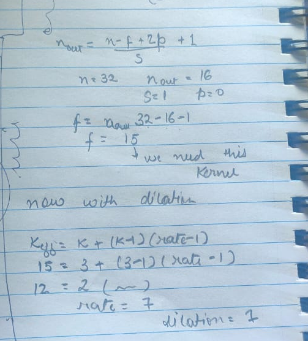
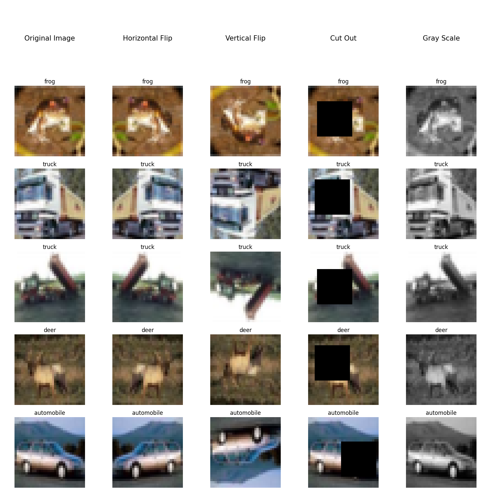
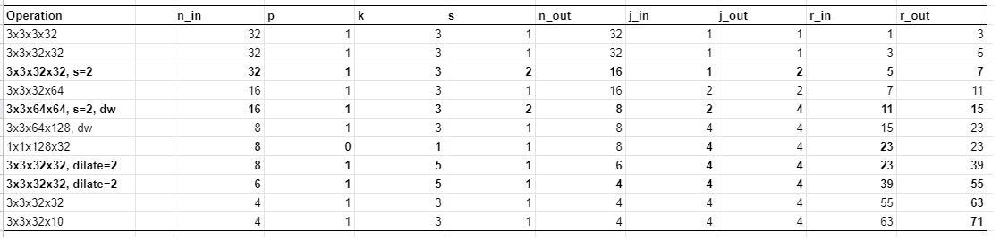
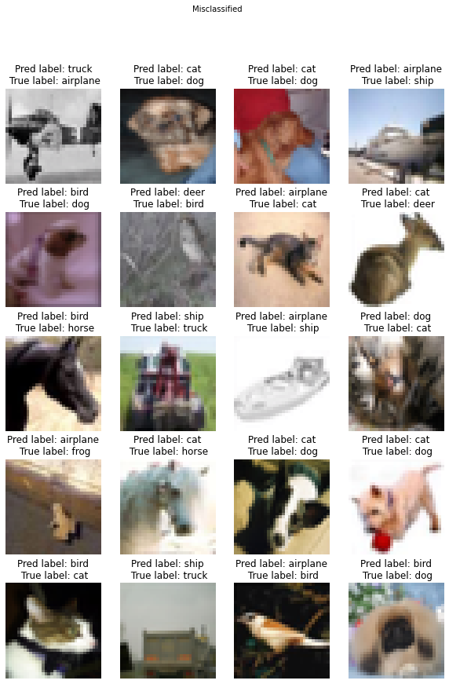

# Submission for Week 7 (Late Assignment ON Time)
- [Problem Statement](#problem-statement)
- [Results & Analysis](#results-analysis)
  * [Augumentaion Strategy Used](#augumentaion-strategy-used)
  * [Our Learnings](#our-learnings)
- [CIFAR-10 Vizualization And Augmentation](#cifar-10-vizualization-and-augmentation)
- [Our Model](#our-model)
  * [Training Log](#training-log)
- [Model Evaluation](#model-evaluation)
  * [Learning Curve](#learning-curve)
  * [Missclassified Images](#missclassified-images)
  * [Accuracy Of Each Class](#accuracy-of-each-class)
- [Refrences](#refrences)
- [Team Members](#team-members)

# Problem Statement

- Fix the network above:
  - change the code such that it uses GPU
  - change the architecture to C1C2C3C40 (No MaxPooling, but 3 3x3 layers with stride of 2 instead) (If you can figure out how to use Dilated kernels here instead of MP or strided convolution, then 200pts extra!)
  - total RF must be more than 52
  - two of the layers must use Depthwise Separable Convolution
  - one of the layers must use Dilated Convolution
  - use GAP (compulsory mapped to # of classes):- CANNOT add FC after GAP to target #of classes 
  - use albumentation library and apply:
      - horizontal flip
      - shiftScaleRotate 
      - coarseDropout (max_holes = 1, max_height=16px, max_width=1, min_holes = 1, min_height=16px, min_width=16px, fill_value=(mean of your dataset), mask_fill_value = None)
      - grayscale
  - achieve 87% accuracy, as many epochs as you want. Total Params to be less than 100k

# Results Analysis
The accuracy of 87% was achieved in 90 epochs. Our model has 86,816 parameters. 
It uses dilated convolution in one of the transition layers.

- [notebook link](https://github.com/vivek-a81/EVA6/blob/main/Session7/S7_finalV2.ipynb)
- [model.py](https://github.com/vivek-a81/EVA6/blob/main/Session7/model.py)

#### Augumentaion Strategy Used

```
A.HorizontalFlip(),
A.ShiftScaleRotate(),
A.CoarseDropout(1, 16, 16, 1, 16, 16,fill_value=0.473363, mask_fill_value=None),
A.ToGray()
```
#### Our Learnings

- Receptive Field was an important parameter to consider in order to get good accuracy. When we designed a model by just keeping the number parameters in mind, it performed very poorly after training. We then created a table to calculate the Receptive Field alongside to keep an eye on how good the receptive field was. Even if we increased the parameters without increasing the RF, the accuracy did not improve. 
- Adding additional pure convolution layer before the first transition block helped.
- Replacing Max Pooling layer with a dilated kernel is a challenge. One way to do this is to use high dilation rate. However, this would lead to high information loss. Hence we read through and found that series of dilated kernels should be used to cover every pixel point on the image. This is called hybrid dilated convolution (HDC).
- Taking reference from mobilenet, we used a depthwise separable convolution with a stride of 2 in place of max pooling. This reduced the number of parameters used significantly.
- Effective Kernel size formula when using dilation **k<sub>eff</sub> = k + (k-1)*(rate-1)**

 
# CIFAR-10 Vizualization And Augmentation

- **DataSet:** CIFAR-10 has 10 classes of 32,32 that are airplane, automobile, bird, cat, deer, dog, frog, horse, ship, truck

<p float="center">
  
</p>

- Augmentation 
Effect of applying the augmentation on some of the test images.

<p float="center">
  
</p>


# Our Model
This is the basic skeleton of our model. The table below shows the calculated receptive field. We have used
1. Two Depthwise Separable Convolutions
2. dilated kernels instead of Max pooling in the last transition block.
3. less than 100k parameters

<p float="center">
  
</p>

```
Total params: 86,816
Trainable params: 86,816
Non-trainable params: 0
```

### Training Log

```
EPOCH: 90

Batch_id=781 Loss=0.57727 Accuracy=79.78: 100%|██████████| 782/782 [00:05<00:00, 140.26it/s]
  0%|          | 0/782 [00:00<?, ?it/s]

Test set: Average loss: 0.3919, Accuracy: 8689/10000 (86.89%)

EPOCH: 91

Batch_id=781 Loss=0.57028 Accuracy=79.96: 100%|██████████| 782/782 [00:05<00:00, 141.06it/s]
  0%|          | 0/782 [00:00<?, ?it/s]

Test set: Average loss: 0.3909, Accuracy: 8701/10000 (87.01%)

EPOCH: 92

Batch_id=781 Loss=0.56919 Accuracy=80.24: 100%|██████████| 782/782 [00:05<00:00, 139.02it/s]
  0%|          | 0/782 [00:00<?, ?it/s]

Test set: Average loss: 0.3909, Accuracy: 8726/10000 (87.26%)

EPOCH: 93

Batch_id=781 Loss=0.56956 Accuracy=80.03: 100%|██████████| 782/782 [00:05<00:00, 139.88it/s]
  0%|          | 0/782 [00:00<?, ?it/s]

Test set: Average loss: 0.3875, Accuracy: 8714/10000 (87.14%)

EPOCH: 94

Batch_id=781 Loss=0.56150 Accuracy=80.12: 100%|██████████| 782/782 [00:05<00:00, 140.19it/s]
  0%|          | 0/782 [00:00<?, ?it/s]

Test set: Average loss: 0.3886, Accuracy: 8706/10000 (87.06%)

EPOCH: 95

Batch_id=781 Loss=0.55917 Accuracy=80.49: 100%|██████████| 782/782 [00:05<00:00, 140.80it/s]
  0%|          | 0/782 [00:00<?, ?it/s]

Test set: Average loss: 0.3875, Accuracy: 8695/10000 (86.95%)

EPOCH: 96

Batch_id=781 Loss=0.55844 Accuracy=80.41: 100%|██████████| 782/782 [00:05<00:00, 140.66it/s]
  0%|          | 0/782 [00:00<?, ?it/s]

Test set: Average loss: 0.3883, Accuracy: 8712/10000 (87.12%)

EPOCH: 97

Batch_id=781 Loss=0.56086 Accuracy=80.50: 100%|██████████| 782/782 [00:05<00:00, 140.29it/s]
  0%|          | 0/782 [00:00<?, ?it/s]

Test set: Average loss: 0.3884, Accuracy: 8712/10000 (87.12%)

EPOCH: 98

Batch_id=781 Loss=0.55907 Accuracy=80.67: 100%|██████████| 782/782 [00:05<00:00, 140.17it/s]
  0%|          | 0/782 [00:00<?, ?it/s]

Test set: Average loss: 0.3868, Accuracy: 8710/10000 (87.10%)

EPOCH: 99

Batch_id=781 Loss=0.55661 Accuracy=80.51: 100%|██████████| 782/782 [00:05<00:00, 141.24it/s]
  0%|          | 0/782 [00:00<?, ?it/s]

Test set: Average loss: 0.3873, Accuracy: 8725/10000 (87.25%)

EPOCH: 100

Batch_id=781 Loss=0.55942 Accuracy=80.51: 100%|██████████| 782/782 [00:05<00:00, 140.16it/s]

Test set: Average loss: 0.3876, Accuracy: 8723/10000 (87.23%)

```

# Model Evaluation

### Learning Curve

<p float="center">
  
</p>

### Misclassified Images
Some interesting observations from the misclassified images
- Huge confusion between cat, dog, deer was seen.
- Some confusion was seen between truck and automobile.
- Further to these, below are some observations based on the test images.

| | | |
| :------------------------------------------------------------: | :----------------------------------------------------------: | :------------------------------------------------------------: |
|   In the first row, the bird got misclassified as a cat. That's probably because the wings of the bird are not visible  | In first row, deer is missclassified as aeroplane, probably because of the blue background and the deer horns look like plane wings. Also, the plane in 2nd row got detected as horse, because the background is not blue. | ship was classified as plane probably because the color under the ship is not blue but the blue sky is visible. Also airplace got classified as a truck since the background is not blue. |
|  |  |  |

### Accuracy Of Each Class

```
Accuracy of airplane : 90 %
Accuracy of automobile : 95 %
Accuracy of  bird : 76 %
Accuracy of   cat : 71 %
Accuracy of  deer : 78 %
Accuracy of   dog : 76 %
Accuracy of  frog : 79 %
Accuracy of horse : 89 %
Accuracy of  ship : 88 %
Accuracy of truck : 77 %
```

Refrences
----------------
- https://arxiv.org/pdf/1803.08904.pdf 
- https://ieeexplore.ieee.org/stamp/stamp.jsp?arnumber=8756165
- https://arxiv.org/pdf/1704.04861.pdf
- https://github.com/zhixuhao/unet/blob/master/model.py
- https://arxiv.org/pdf/1505.04597.pdf


Team Members
------------------------

Neha Mittal, Vivek Chaudhary

