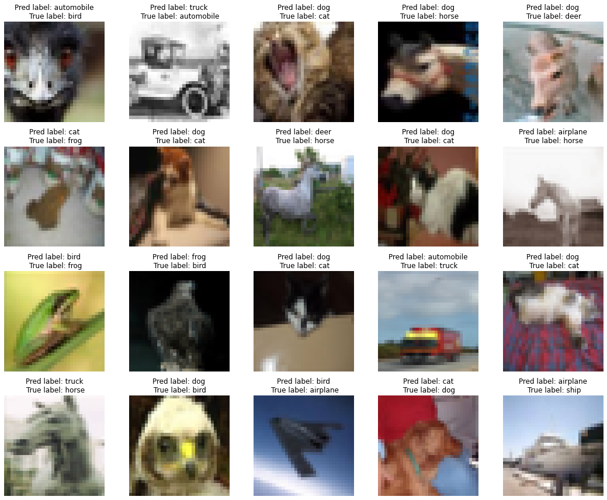

# Submission for Week 8 (Late Assignment ON Time)

- [Problem Statement](#problem-statement)
- [Results & Analysis](#results-analysis)
- [CIFAR-10 Augmentation Vizulation](#cifar-10-augmentation-vizualization)
- [Model Evaluation](#model-evaluation)
  * [ResNet 18 Learning Curve](#resnet-18-learning-curve)
  * [ResNet 18 Misclassified Images](#resnet-18-misclassified-images)
  * [ResNet 34 Learning Curve](#resnet-34-learning-curve)
  * [ResNet 34 Misclassified Images](#resnet-34-misclassified-images)
  * [Grad-Cam](#grad-cam)
- [Team Members](#team-members)

# Problem Statement

- - Train ResNet18 and ResNet34 for 40 Epochs
  - **20** misclassified images
  - **20** GradCam output on the **SAME misclassified images**
  - Apply these transforms while training:
      1. RandomCrop(32, padding=4)
      2. CutOut(16x16)
      3. **Rotate(±5°)**
  - **Must** use ReduceLROnPlateau
  - **Must** use LayerNormalization ONLY

# Results Analysis

# CIFAR-10 Augmentation Vizualization

- **DataSet:** CIFAR-10 has 10 classes of 32,32 that are airplane, automobile, bird, cat, deer, dog, frog, horse, ship, truck

  

# Model Evaluation

ResNet 18 Learning Curve
--------------------------

  

ResNet 18 Misclassified Images
--------------------------

  

ResNet 34 Learning Curve
--------------------------

  

ResNet 34 Misclassified Images
--------------------------

  

Team Members
------------------------

Neha Mittal, Vivek Chaudhary

