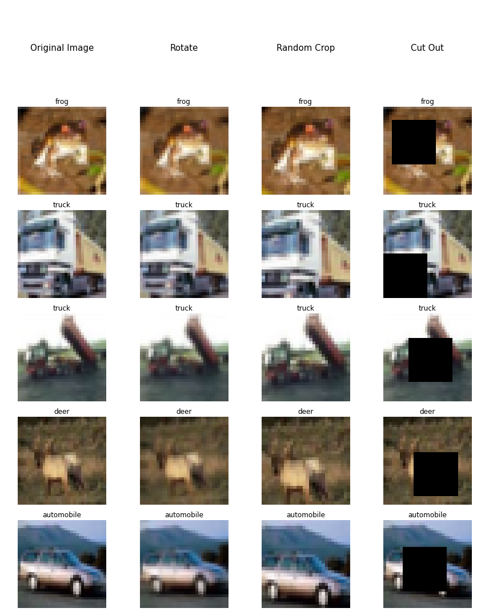
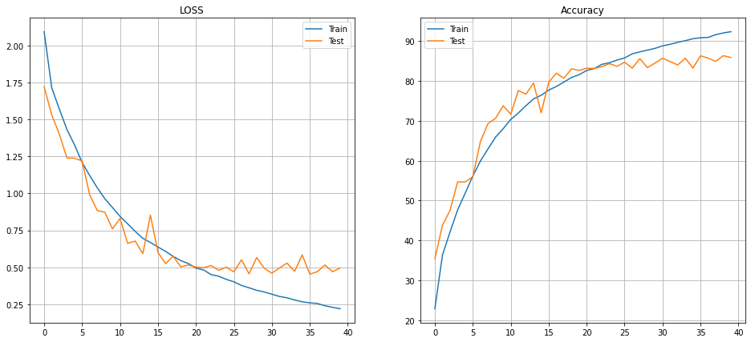
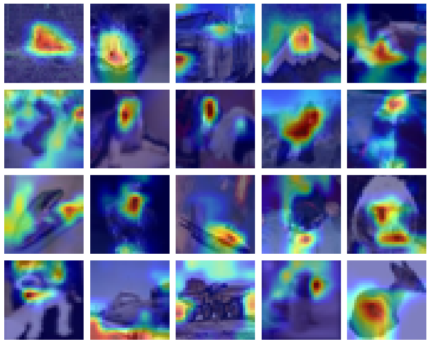

# Submission for Week 8 (Late Assignment ON Time)

- [Problem Statement](#problem-statement)
- [Results & Analysis](#results-analysis)
- [CIFAR-10 Augmentation Vizulation](#cifar-10-augmentation-vizualization)
- [Model Evaluation](#model-evaluation)
  * [ResNet 18 Learning Curve](#resnet-18-learning-curve)
  * [ResNet 18 Misclassified Images](#resnet-18-misclassified-images)
  * [Grad-Cam ResNet 18](#gradcam-resnet18)
- [Team Members](#team-members)


# Problem Statement

- - Train ResNet18 for 40 Epochs
  - **20** misclassified images
  - **20** GradCam output on the **SAME misclassified images**
  - Apply these transforms while training:
      1. RandomCrop(32, padding=4)
      2. CutOut(16x16)
      3. **Rotate(±5°)**
  - **Must** use ReduceLROnPlateau
  - **Must** use LayerNormalization ONLY

# Results Analysis

- Test Accuracy : 88.01%
- Train Accuracy : 87.74%
- In the last layer of ResNet18 we have used stide of 1
- We also trained ResNet 34 which overfitted on class **Truck**

Agumentation Strategy Used
```
A.Compose({
  A.Rotate (limit=5, interpolation=1, border_mode=4, value=None, mask_value=None, always_apply=False, p=0.5),
  A.Sequential([A.CropAndPad(px=4, keep_size=False), #padding of 2, keep_size=True by default
                A.RandomCrop(32,32)]),
  A.CoarseDropout(1, 16, 16, 1, 16, 16,fill_value=0.473363, mask_fill_value=None),
  A.Normalize((0.49139968, 0.48215841, 0.44653091), (0.24703223, 0.24348513, 0.26158784)),
})
```

# CIFAR-10 Augmentation Vizualization

- **DataSet:** CIFAR-10 has **10 classes** of **32,32** that are **Airplane, Automobile, Bird, Cat, Deer, Dog, Frog, Horse, Ship & Truck**

<p float="center">
  
</p>


# Model Evaluation

We have plotted
* ResNet 18 Learning Curve
* ResNet 18 Misclassified Images
* Grad-Cam ResNet 18


ResNet 18 Learning Curve
--------------------------

<p float="center">
  
</p>


ResNet 18 Misclassified Images
--------------------------

<p float="center">
  
</p>


GradCam ResNet18
--------------------------

<p float="center">
  
</p>


References
------------------------

* https://pytorch.org/tutorials/beginner/former_torchies/nnft_tutorial.html
* http://gradcam.cloudcv.org/
* https://github.com/kazuto1011/grad-cam-pytorch/tree/fd10ff7fc85ae064938531235a5dd3889ca46fed


Team Members
------------------------

Neha Mittal, Vivek Chaudhary

