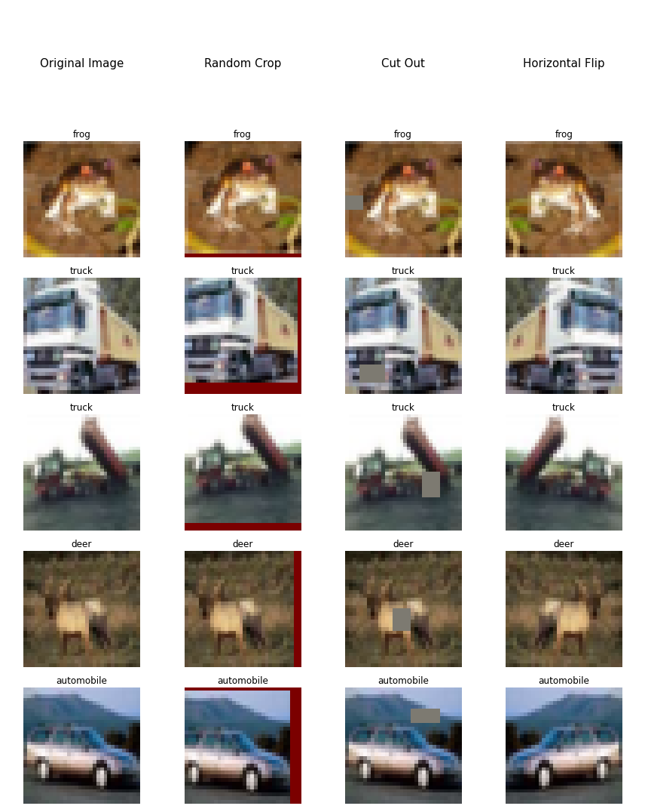

# Submission for Week 9 (Early Assignment ON Time)

- [Problem Statement](#problem-statement)
- [Results & Analysis](#results-analysis)
- [CIFAR-10 Augmentation Vizulation](#cifar-10-augmentation-vizualization)
- [Model Evaluation](#model-evaluation)
  * [Custom-resnet Learning Curve](#Custom-resnet-learning-curve)
  * [Custom-resnet Misclassified Images](#Custom-resnet-misclassified-images)
  * [Grad-Cam Custom-resnet](#gradcam-Custom-resnet)
- [Team Members](#team-members)


# Problem Statement
- - **Write a custom ResNet architecture for CIFAR10 that has the following architecture:**
  - PrepLayer - Conv 3x3 s1, p1) >> BN >> RELU [64k]
  - Layer1 -
    - X = Conv 3x3 (s1, p1) >> MaxPool2D >> BN >> RELU [128k]
    - R1 = ResBlock( (Conv-BN-ReLU-Conv-BN-ReLU))(X) [128k] 
    - Add(X, R1)
  - Layer 2 -
    - Conv 3x3 [256k]
    - MaxPooling2D
    - BN
    - ReLU
  - Layer 3 -
    - X = Conv 3x3 (s1, p1) >> MaxPool2D >> BN >> RELU [512k]
    - R2 = ResBlock( (Conv-BN-ReLU-Conv-BN-ReLU))(X) [512k]
    - Add(X, R2)
   - MaxPooling with Kernel Size 4
   - FC Layer 
   - SoftMax
  - Uses One Cycle Policy such that:
  - Total Epochs = 24
  - Max at Epoch = 5
  - LRMIN = FIND
  - LRMAX = FIND
  - NO Annihilation
  - Uses this transform -RandomCrop 32, 32 (after padding of 4) >> FlipLR >> Followed by CutOut(8, 8)
  - Batch size = 512
 - Target Accuracy: 90% (93% for late submission or double scores). 
 - NO score if your code is not modular. Your collab must be importing your GitHub package, and then just running the model. I should be able to find the custom_resnet.py model in your GitHub repo that you'd be training. 
 - Once done, proceed to answer the Assignment-Solution page. 


# Results Analysis
Link to [Notebook](https://github.com/vivek-a81/EVA6/blob/main/Session8/session_8.ipynb)

Link to [Main Repo](https://github.com/MittalNeha/vision_pytorch)
- Test Accuracy : 88.00%
- Train Accuracy : 87.74%
- In the last linear layer few experiments were leading us to a better result
- Adding L2 Regularisation boosted the performance of the model  

Augmentation Strategy Used
```
     A.Sequential([
                   A.CropAndPad(px=4, keep_size=False), #padding of 2, keep_size=True by defaulf
                   A.RandomCrop(32,32)
                   ]),
     A.HorizontalFlip(),
     A.CoarseDropout(1, 8, 8, 1, 8, 8,fill_value=0.473363, mask_fill_value=None),
     A.Normalize((0.49139968, 0.48215841, 0.44653091), (0.24703223, 0.24348513, 0.26158784))
```

# CIFAR-10 Augmentation Vizualization

- **DataSet:** CIFAR-10 has **10 classes** of **32,32** that are **Airplane, Automobile, Bird, Cat, Deer, Dog, Frog, Horse, Ship & Truck**

<p float="center">
  
</p>


# Model Evaluation

We have plotted
* Custom resnet Learning Curve
* Custom resnet Misclassified Images
* Grad-Cam Custom resnet


Custom resnet Learning Curve
--------------------------

<p float="center">
  
</p>


Custom resnet Misclassified Images
--------------------------

<p float="center">
  
</p>


GradCam Custom resnet
--------------------------

<p float="center">
  
</p>


References
------------------------

* https://pytorch.org/tutorials/beginner/former_torchies/nnft_tutorial.html
* http://gradcam.cloudcv.org/
* https://github.com/kazuto1011/grad-cam-pytorch/tree/fd10ff7fc85ae064938531235a5dd3889ca46fed


Team Members
------------------------

Neha Mittal, Vivek Chaudhary

